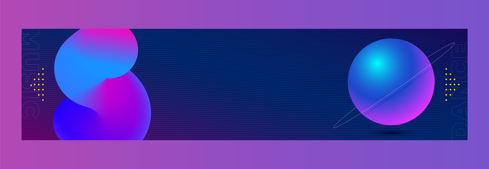

<h3 align="center">Hi 👋, I'm Redwan </h1>

  

 - 👋 My name is Redwan Tahir Mohammed-Nur, I am  graduate in Diploma in Information Technology, Bachelors in computer Science and Software Engineering, and Masters in Computer Science.

 - A passionate Full-stack developer from Ethiopian. A skilled and motivated individual with strong critical thinking and decision-making skills, as well as strong attention to detail

- 🔭Currently a student at Microverse as of May 2023, learning how to code various programming languages, for Full stack web developer **Microverse**
- 🌱 I’m currently learning **React**

- 👨‍💻 All of my projects are available at [https://github.com/ethred](https://github.com/ethred)

- 💬 Ask me about **Html, CSS and JavaScript**

<h3 align="left">Connect with me:</h3>

<h3 align="left">Languages and Tools:</h3>

               

&nbsp;

